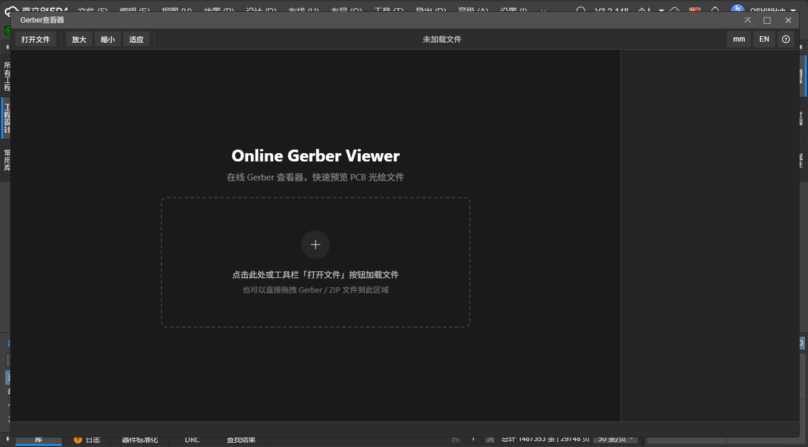
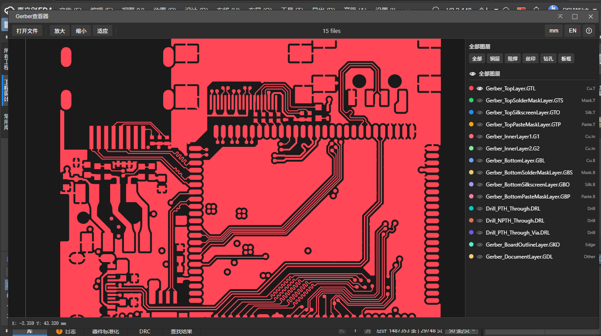

[简体中文](./README.md) | [English](./README.en.md) | [繁體中文](./README.zh-Hant.md) | [日本語](./README.ja.md) | [Русский](#)

# Gerber Viewer

Расширение для просмотра Gerber-файлов в EasyEDA с поддержкой форматов RS-274X и Excellon и многослойным наложением. Расширение позволяет получить Gerber-файлы прямо из текущей PCB и просмотреть их во встроенном просмотрщике, что упрощает проверку производственных данных после завершения проектирования.

> **Примечание:** Этот просмотрщик предназначен только для справки и не гарантирует полной корректности отображения. Для точного просмотра Gerber рекомендуется использовать JLCPCB DFM, доступный через верхнее меню: **Дизайн → Проверить DFM** для отправки Gerber-файлов в JLCPCB DFM одним нажатием.

## Функции

- **Просмотр PCB Gerber...** — Получает Gerber из текущей PCB и автоматически открывает в просмотрщике
- **Открыть Gerber просмотрщик...** — Открывает пустой просмотрщик для ручной загрузки файлов

| Обзор функций | Просмотр Gerber |
| --- | --- |
|  |  |

## Начало работы

```bash
git clone https://github.com/easyeda/eext-gerber-viewer.git
cd eext-gerber-viewer
npm install
npm run build
```

Установите сгенерированный файл `.eext` в EasyEDA для начала работы.

## Лицензия

Этот проект распространяется под лицензией [Apache-2.0](https://github.com/easyeda/eext-gerber-viewer/blob/main/LICENSE). EasyEDA является зарегистрированной торговой маркой компании JLCPCB.
